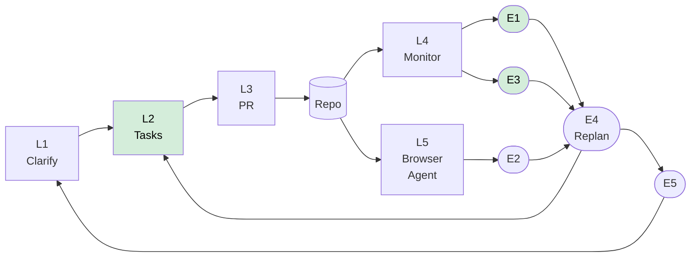

# CUE Hub — Documentation

> Built on LLM4RE principles: **spec is the single source of truth**.
> Tasks derive from specs. Code traces back to specs. Progress writes back to specs.

---

## Directory Structure

```
docs/
├── vision/           ← North star: product positioning + feasibility spec
├── specs/            ← Component specs (LLM4RE core — AI PM reads these)
├── architecture/     ← Technical decisions (ADR) + data models
├── research/         ← Agent patterns + open-source solutions + benchmarks
├── superpowers/      ← Daily dev plans + design docs (legacy, keep)
│   ├── plans/
│   └── specs/
├── AI-PM-PROGRESS.md ← Written by AI PM automatically — do not edit manually
└── 开发进度.md        ← Manual progress log (legacy)
```

---

## What Goes Where

| Directory | Write what | Who writes | Update frequency |
|---|---|---|---|
| `vision/` | Product positioning, feasibility | Product lead | Low |
| `specs/` | Layer/edge requirements + acceptance criteria | Product + eng | Per phase |
| `architecture/adr/` | Why a technical decision was made | Tech lead | Low |
| `research/` | Theory + open-source analysis | Anyone | Low |
| `superpowers/plans/` | Concrete implementation tasks | Engineers | High |
| `AI-PM-PROGRESS.md` | Current milestone progress | **AI PM (auto)** | Each sync |

---

## Closed Loop Architecture



> Green = Phase 1 priority

---

## Traceability Convention

| Artifact | ID Format | Example |
|---|---|---|
| Requirement | `REQ-L2-001` | in `## 2. Requirements` of each SPEC |
| Acceptance criterion | `AC-E1-001` | in `## 4. Acceptance Criteria` of each SPEC |
| Task | `task_xxx_yyy` | in hub task board + commit messages |
| PR | GitHub PR URL | stored in `task.evidenceRefs` |

---

## Quick Navigation

| I want to... | Go to |
|---|---|
| Understand the product vision | [vision/product-vision.md](vision/product-vision.md) |
| See how much of the vision is buildable | [vision/feasibility-spec-agentic-sdlc.md](vision/feasibility-spec-agentic-sdlc.md) |
| Find what to implement next | [specs/README.md](specs/README.md) — look for Phase 1 ★ |
| Understand a tech decision | [architecture/adr/](architecture/adr/) |
| Look up data schemas | [architecture/data-models.md](architecture/data-models.md) |
| Understand the theory | [research/agent-patterns.md](research/agent-patterns.md) |
| See which open-source tools we use | [research/open-source-solutions.md](research/open-source-solutions.md) |
