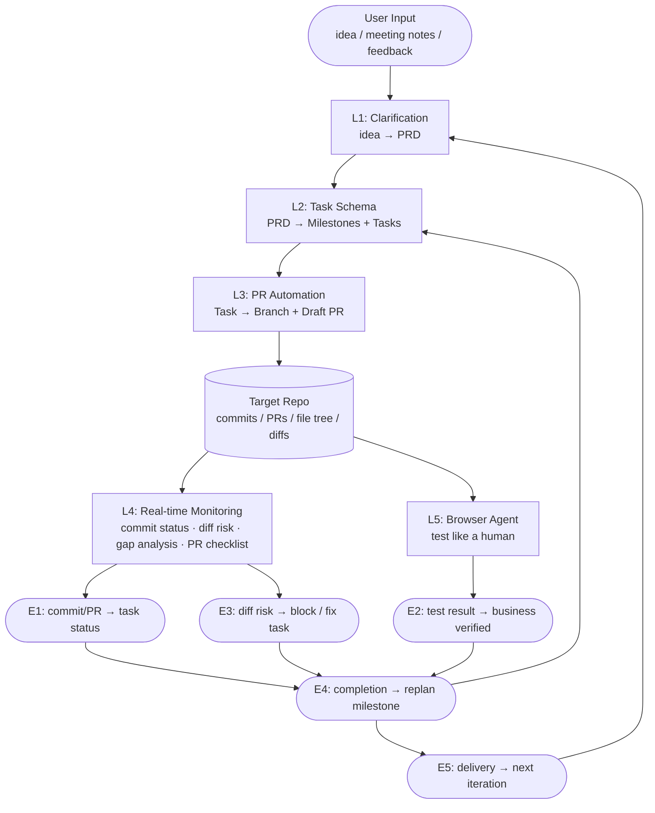
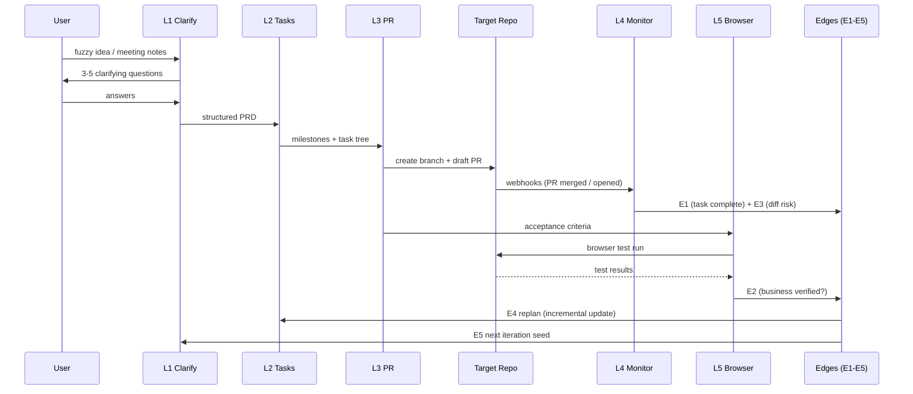
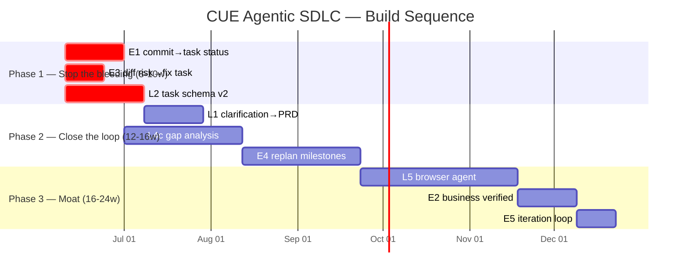
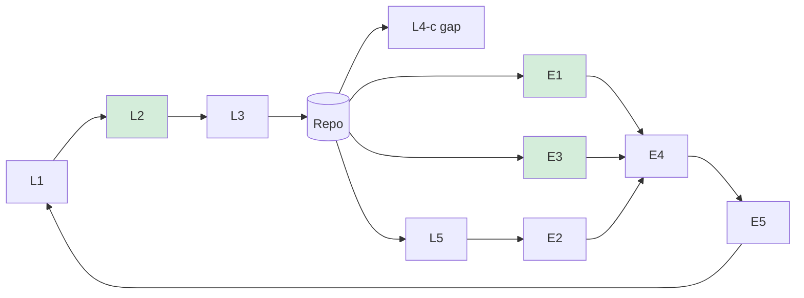

# System Overview — CUE Agentic SDLC

## Architecture

## Data Flow

## Module Mapping (Code → Spec)

| Spec | Code File | Status |
|---|---|---|
| L1 | `server/services/prdClarifier.js` (new) | ❌ not built |
| L2 | `server/services/docsManager.js` (rewrite schema) | ⚠️ refactor |
| L3 | `server/services/githubApi.js` (extend) | ⚠️ extend |
| L4-c | `server/services/gapAnalyzer.js` (new) | ❌ not built |
| L5 | `server/services/browserTestRunner.js` (new) | ❌ not built |
| E1 | `server/services/semanticLinker.js` (add state write-back) | ⚠️ extend |
| E2 | `server/services/testResultLinker.js` (new) | ❌ not built |
| E3 | `server/services/reviewTaskLinker.js` (new, <50 lines) | ❌ not built |
| E4 | `server/services/replanEvaluator.js` (new) | ❌ not built |
| E5 | `server/services/dailyBrief.js` (extend milestone retro) | ⚠️ extend |

## Implementation Phases

## Dependency Graph

> Green nodes = Phase 1 priority (strongest seed, stop the bleeding first)
