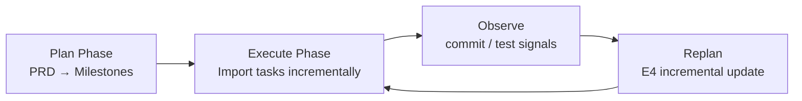
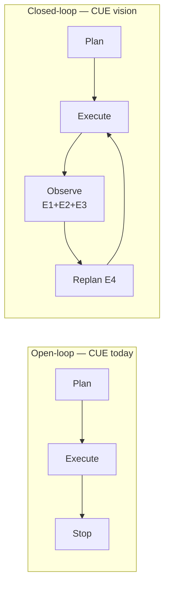
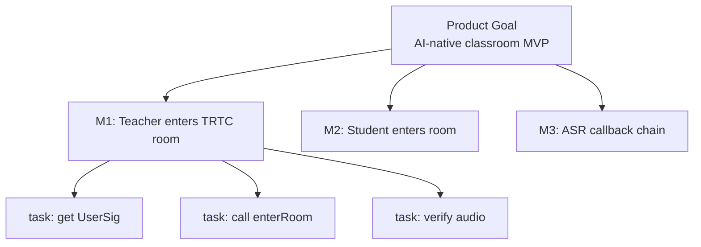
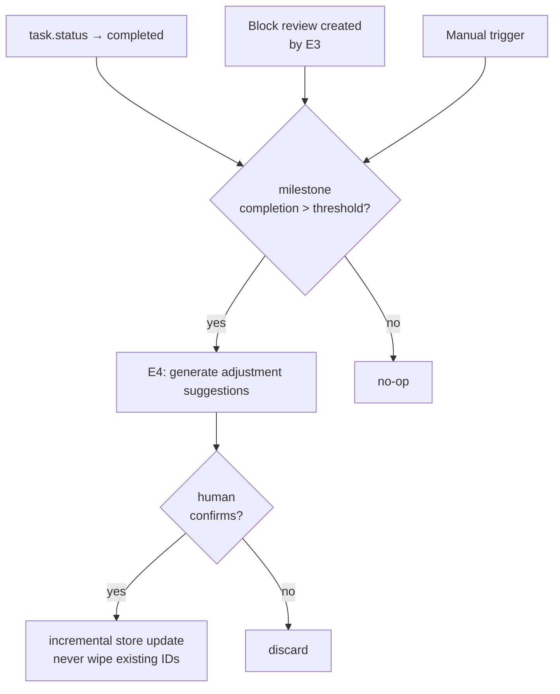

# Agent Control Patterns

> The theoretical foundation of CUE Agentic SDLC. Each concept maps directly to a specific problem in CUE.

---

## 1. ReAct (Reason + Act)

**Paper**: Yao et al., ICLR 2023
**One line**: Think one step → take one action → observe result → think again

```
Thought:  I need to find the student-side room entry implementation
Action:   read_file("src/student/join.js")
Observation: file exists but enterRoom() is never called
Thought:  enterRoom() is missing — this is an unfinished task
Action:   create_task("Implement enterRoom for student web")
```

**CUE mapping**: AI PM's document parsing + gap analysis should be a ReAct loop, not a one-shot extraction.

---

## 2. Reflexion (Self-reflection reinforcement)

**Paper**: Shinn et al., NeurIPS 2023
**One line**: After failure, generate a verbal "retrospective note" and carry it into the next attempt

```
Attempt 1: parse docs → generate tasks → tasks don't match code reality
Reflection: "I generated tasks without reading the code first.
             Next time I should inspect the file tree before planning."
Attempt 2: carry reflection → inspect code first → generate accurate gap analysis
```

**CUE mapping**: This is the theoretical prototype of E4 (replan on deviation). The current AI PM has zero reflection mechanism — every sync starts from scratch.

---

## 3. Plan-and-Execute

**One line**: Plan the full roadmap first, then execute step by step (planning and execution are separate)



**CUE mapping**: PRD → Milestones (plan phase) → tasks imported gradually (execute phase). The two must be separated — current `docsManager` mixes them, causing the "task board resets to zero" problem.

---

## 4. Open-loop vs Closed-loop Execution

**Open-loop**: Generate a plan, execute it, ignore the results.
**Closed-loop**: Use execution results to correct the plan, loop until goal is reached.



**Why open-loop always fails**:
> "Once a plan is generated, execution failures (or completions) are never fed back to revise the decomposition or allocation policies."
> — LLM-Based Multi-Agent for SE, ACM TOSEM 2025

**CUE evidence**: The 5/31 event — full re-parse created 22 new task IDs at the same second, wiping out all 24 task↔commit links from May 3–22. Zero overlap. Classic open-loop failure.

---

## 5. Hierarchical Task Decomposition

**One line**: High-level agent owns the goal, delegates to lower-level agents for specifics



**CUE mapping**: SPEC-L2's three-tier schema (Milestone → Task → Subtask).
**Current problem**: `phases: 0` — AI PM jumps from document directly to flat micro-tasks, the middle layer is completely lost.

---

## 6. State-triggered Replanning

**One line**: Trigger replanning when state changes (task completes / plan deviates), not on a fixed timer



**CUE mapping**: ADR-002 core design. Replaces the catastrophic "full re-parse on every sync" with event-driven incremental updates.

---

## Further Reading

| Paper | Link |
|---|---|
| ReAct | https://arxiv.org/abs/2210.03629 |
| Reflexion | https://arxiv.org/abs/2303.11366 |
| Global Planning & Hierarchical Execution | https://arxiv.org/abs/2504.16563 |
| LLM Multi-Agent for SE (TOSEM 2025) | https://dl.acm.org/doi/10.1145/3712003 |
| TraceLLM — requirements traceability SOTA | https://arxiv.org/abs/2602.01253 |
| LLM4RE survey | https://arxiv.org/abs/2509.11446 |
