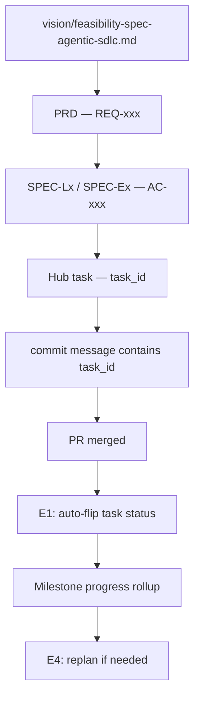

# Specs — Component Specifications

Each spec maps to one Layer or Edge of the Agentic SDLC closed loop.

**Why specs exist**: AI PM parses these to generate structured tasks. Every requirement has a traceable ID from spec → task → commit → PR → status.

## Spec Index

### Layers (main delivery chain)

| Spec | Title | Status | Fidelity | Phase |
|---|---|---|---|---|
| [SPEC-L1](SPEC-L1-clarification.md) | Clarification → Standard PRD | draft | 85% | 2 |
| [SPEC-L2](SPEC-L2-task-schema.md) | PRD → Milestones + Task schema | draft | 78% | 1 |
| [SPEC-L3](SPEC-L3-pr-automation.md) | Task → Auto-create PR | draft | 90% | 1 |
| [SPEC-L4](SPEC-L4-monitoring.md) | Real-time monitoring (repo / PR / gap) | draft | 65% | 2 |
| [SPEC-L5](SPEC-L5-browser-agent.md) | Browser Agent — test like a human | draft | 48% | 3 |

### Edges (feedback loops that close the cycle)

| Spec | Title | Status | Fidelity | Phase |
|---|---|---|---|---|
| [SPEC-E1](SPEC-E1-commit-tracking.md) | commit/PR → task status auto-flip | draft | 80% | 1 ★ |
| [SPEC-E2](SPEC-E2-browser-testing.md) | test result → business verified | draft | 48% | 3 |
| [SPEC-E3](SPEC-E3-diff-risk.md) | diff risk → block / new fix task | draft | 83% | 1 ★ |
| [SPEC-E4](SPEC-E4-replanning.md) | completion → replan milestone | draft | 65% | 2 |
| [SPEC-E5](SPEC-E5-iteration.md) | delivery → next iteration seed | draft | 80% | 3 |

★ = Phase 1 priority — strongest seed, fix "task board resets to zero" first

## Traceability Chain

## How to Write a Spec

Use [SPEC-template.md](SPEC-template.md).

Rules:
1. Every requirement must have a `REQ-XX-NNN` ID
2. Every acceptance criterion must have an `AC-XX-NNN` ID
3. Fill the YAML frontmatter (`phase`, `fidelity`, `dependencies`)

## AI PM Parsing Rules

When AI PM generates tasks from a spec:
1. Reads `## 4. Acceptance Criteria` checklist → becomes `task.acceptance`
2. Reads `## 2. Requirements` REQ IDs → becomes `task.requirementRefs`
3. Reads `dependencies` frontmatter → becomes `task.dependencies`
4. Reads `phase` frontmatter → determines import priority
